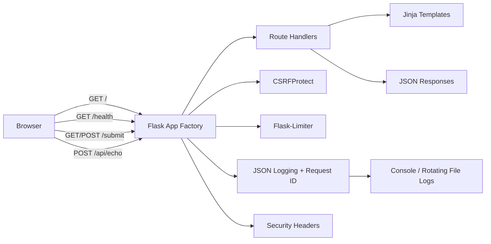

# Architecture Overview

This project is intentionally small so learners can understand the full request flow quickly.

## Request Flow (High Level)



## App Structure

```mermaid
flowchart TD
    apppy[app.py / wsgi.py] --> createapp[app.create_app()]
    createapp --> configpy[config.py]
    createapp --> ratelimit[app/ratelimit.py]
    createapp --> templates[app/templates/*.html]
    createapp --> static[app/static/*]
    createapp --> tests[tests/test_app.py]
```

## Security-Relevant Components
- `CSRFProtect` protects HTML form submissions
- `Flask-Limiter` applies default and route-specific limits
- Request IDs are attached to responses and logs
- Security headers are added in an `after_request` hook
- `ProxyFix` can be enabled with `TRUST_PROXY_COUNT` when behind a trusted reverse proxy

## Deployment Modes
- Local Python run (`python app.py`)
- Installed package run (`flaskappenhanced` or `python -m app`)
- Docker container (`Dockerfile`)
- GitHub Releases for Python artifacts (`.whl`, `.tar.gz`)
- GHCR for container package (`.github/workflows/package.yml`)
