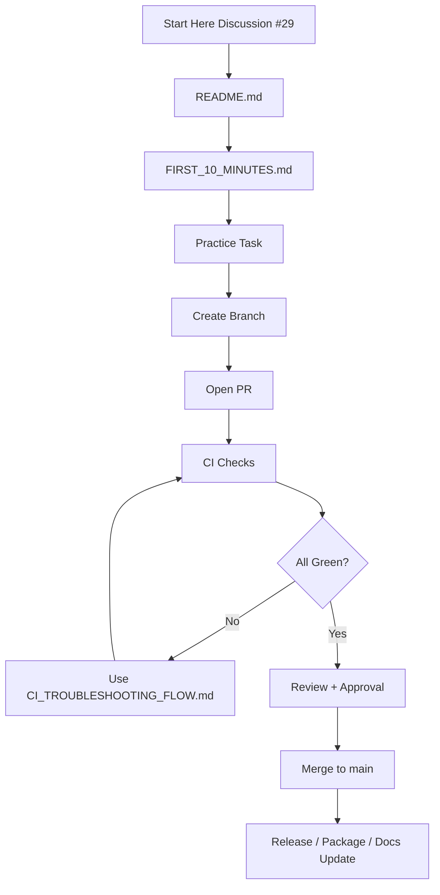

# Repository Flow Map

```mermaid
flowchart TD
  A[Start Here Discussion #29] --> B[README.md]
  B --> C[FIRST_10_MINUTES.md]
  C --> D[Practice Task]
  D --> E[Create Branch]
  E --> F[Open PR]
  F --> G[CI Checks]
  G --> H{All Green?}
  H -- No --> I[Use CI_TROUBLESHOOTING_FLOW.md]
  I --> G
  H -- Yes --> J[Review + Approval]
  J --> K[Merge to main]
  K --> L[Release / Package / Docs Update]
```

Use this map in onboarding posts and maintainer walkthroughs.
